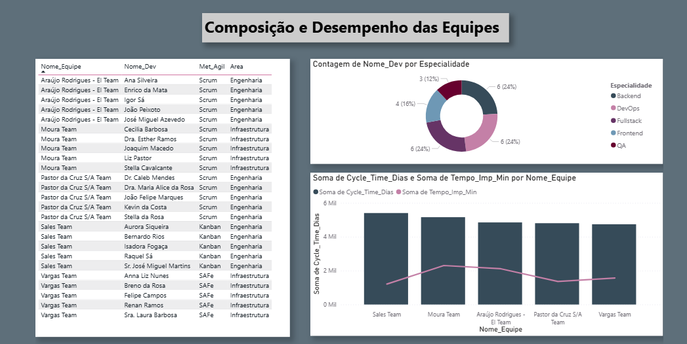

# 📊 Portfólio de Análise de Dados & KPIs Ágeis | Data & Agile KPI Analysis Portfolio

Este repositório reúne projetos que demonstram minha capacidade de **analisar, interpretar e comunicar métricas estratégicas** para apoiar decisões e otimizar processos — especialmente em contextos **Agile, Scrum e Lean**.

As análises utilizam **dados sintéticos realistas** ou conjuntos anonimizados, explorando tecnologias como **Python, Pandas, SQL, Power BI, Scikit-Learn** e integrações com ferramentas corporativas como **Azure DevOps e Jira**.

---

## 🚀 Destaques / Highlights

### 🇧🇷 Projeto 01 — Otimização de Lead Time em Times Ágeis  
**Objetivo**: Identificar gargalos e reduzir o Lead Time de um time Scrum, analisando dados de sprints e fluxo de trabalho.  
**Resultados**:
- Redução média de **25%** no Lead Time (de 4 para 3 dias por sprint).
- Identificação dos principais bloqueios: backlog não refinado, aprovações lentas e transferência de tarefas.
- Implementação de dashboard interativo para monitoramento contínuo.

**Visual Preview:**  

**Dashboard Interativo (Power BI)**: [Clique aqui para acessar](https://app.powerbi.com/groups/a810e3dc-87a8-4454-98de-1471784e8220/reports/5d0b0c9a-0657-40f7-ac9d-1d619cb93f95/3242db189250edbcdd2b?ctid=2bf9935a-f022-47dd-94d7-98f39af6f562&experience=power-bi)  
**Relatório Completo (PDF)**: [Ver relatório](https://drive.google.com/file/d/1HwN4XlrBTPJOB85ZLr0LFgG1VxZZf_tR/view?usp=sharing)  
**Notebook & Dados**: [Abrir no Colab](https://colab.research.google.com/drive/1Fpk0DgE2_ftaCGr1UUokESuiXLNoR2g2?authuser=2#scrollTo=kF4DnYE6Wwad)

---

### 🇺🇸 Project 01 — Agile Lead Time Optimization  
**Objective**: Identify bottlenecks and reduce Lead Time in a Scrum team by analyzing sprint history and workflow data.  
**Key Results**:
- Reduced average Lead Time by **25%** (from 4 to 3 days per sprint cycle).
- Identified top 3 delay causes: unrefined backlog, slow approvals, task handoff delays.
- Built an interactive dashboard for continuous monitoring.

**Visual Preview:**  

**Interactive Dashboard (Power BI)**: [Access here](https://app.powerbi.com/groups/a810e3dc-87a8-4454-98de-1471784e8220/reports/5d0b0c9a-0657-40f7-ac9d-1d619cb93f95/3242db189250edbcdd2b?ctid=2bf9935a-f022-47dd-94d7-98f39af6f562&experience=power-bi)  
**Full Report (PDF)**: [View Report](https://drive.google.com/file/d/1HwN4XlrBTPJOB85ZLr0LFgG1VxZZf_tR/view?usp=sharing)  
**Notebook & Data**: [Open in Colab](https://colab.research.google.com/drive/1Fpk0DgE2_ftaCGr1UUokESuiXLNoR2g2?authuser=2#scrollTo=kF4DnYE6Wwad)

---

## 📌 Tecnologias & Skills
- **Linguagens & Bibliotecas**: Python, Pandas, NumPy, Scikit-Learn, Matplotlib, Seaborn
- **Bancos & Consultas**: SQL, SQLite
- **Visualização & BI**: Power BI, Tableau (básico)
- **Ferramentas Ágeis**: Jira, Azure DevOps, Miro, Confluence
- **Metodologias**: Scrum, Kanban, Lean Six Sigma
- **IA Aplicada**: Prompt Engineering, Geração de Dados Sintéticos, Análise Assistida por LLMs

---

## 📂 Estrutura do Repositório / Repository Structure
.
├── notebooks/ # Jupyter notebooks com análises e modelos
├── src/ # Scripts Python reutilizáveis
├── data/ # Dados sintéticos (versão pública)
├── reports/ # Relatórios finais (PDF/Markdown)
├── visualizations/ # Capturas de dashboards e gráficos
└── README.md # Este arquivo

yaml
Copiar
Editar

---

## 🎯 Próximos Projetos / Upcoming Projects
- **Throughput & Predictability Analysis** com dados Jira/ADO
- **AI-assisted Retrospective Insights** usando LLMs para detectar padrões de melhoria
- **WIP Flow Optimization** via simulação de cenários
- **Value Stream Mapping com IA** para identificar gargalos de entrega
- **Dashboards Executivos** com métricas estratégicas para stakeholders

---

## 📬 Contato / Contact
💼 https://www.linkedin.com/in/roberta-reis-heinrich/
📧 roberta.heinrich@gmail.com
📊 [GitHub](https://github.com/RobertaRH)

---
